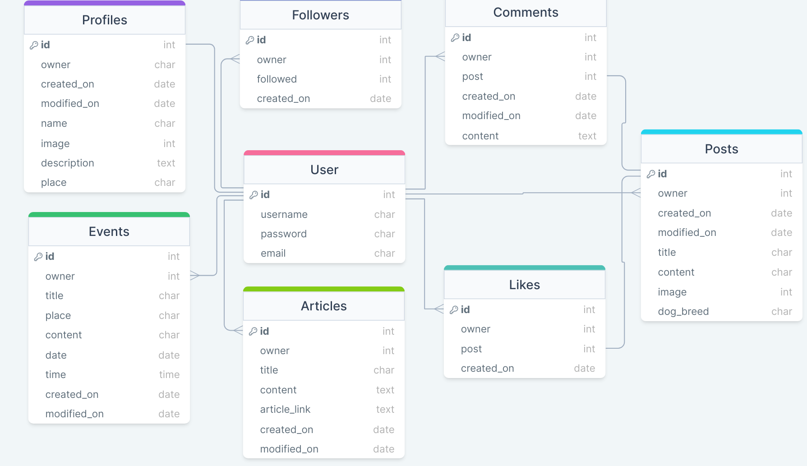

# Petsroom - API

Petsroom is a social media platform for the people who like animals, and would like to scroll through only animal posts. Users can create an events to meet with locals for a walk or any social gathering. Users can also share interesting articles they came across browsing the web. Users can interact with each others through comments. This section of the project is the backend API database built to support the ReactJS frontend, and it is powered by the Django Rest Framework.

DEPLOYED BACKEND API - [LINK](https://petsroom-drf-api-11e537707187.herokuapp.com/)

DEPLOYED FRONTEND - [LIVE SITE](https://petsroom-478d60bcd402.herokuapp.com/)

DEPLOYED FRONTEND - [GITHUB-REPOSITORY](https://github.com/DarkoZlatarek/project5-petsroom)

## [Table of content](#table-of-content)
* [User Stories](#user-stories)
* [Database](#database)
* [Testing](#testing)
    * [Validator testing](#validator-testing)
    * [Manual testing](#manual-testing)
    * [Testing with django](#testing-with-django)
    * [Unfixed bugs](#unfixed-bugs)
* [Technologies used](#technologies-used)
    * [Main Languages Used](#main-languages-used)
    * [Frameworks, Libraries & Programs Used](#frameworks)
* [Deployment](#deployment)
* [Credits](#credits)


## **User Stories**<span id="user-stories"><span>

All User Stories have been documented in their own file, the link for which can be found here: [User Stories](https://github.com/DarkoZlatarek/petsroom-drf-api/blob/main/static/userstories.md).

Links to the GitHub Issues for this project can be found [HERE](https://github.com/DarkoZlatarek/project5-petsroom/issues).
Link to KANBAN boardcan be found [HERE](https://github.com/users/DarkoZlatarek/projects/6/views/1).

## **Database**<span id="database"><span>


## **Testing**<span id="testing"><span>

### **Validator testing**<span id="validator-testing"><span>

All files passed through [CI Python Linter](https://pep8ci.herokuapp.com/) without error.


### **Manual testing**<span id="manual-testing"><span>

1. Manually verified each url path opens & works without error
2. Verified that the CRUD functionality is available in each app: Articles, Events, Comments, Followers, Likes, Posts, Profiles
* Checked this by going to each link;
* Created a new item:
    * When creating an event, there was a possibility to select the date in the past
    * This was fixed by adding validate_date function in Event's models.py as per [Stack Overflow](https://stackoverflow.com/questions/50002600/django-models-datefield-prevent-past);
* Checked new item URL path;
* Edited the item without error;
* Deleted the item without error;
3. Ensured search feature for Posts, Events & Articles apps returns results without error
4. Repeated the steps for the deployed API using superuser without error


### **Testing With Django**<span id="testing-with-django"><span>

* tests wouldn't run - was missing DEV in env.py and with [stackoverflow](https://stackoverflow.com/questions/56318323/django-postgresql-tests-py-runtimewarning-error) I was able to realise that

* test_logged_in_user_can_create_an_event - self.assertEqual(count, 1) throwing fail 0 != 1 - fixed by adding "place" as well as the "title" into response

* test_user_cant_update_event_they_dont_own - event updating was able by any user - fixed by changing permission_classes to [IsOwnerOrReadOnly] in Event views.py under EventDetail

### **Unfixed bugs**<span id="unfixed-bugs"><span>

* None so far

## **Technologies use**<span id="technologies-used"><span>

### **Main Languages Used**<span id="main-languages-used"><span>

* Python

### **Frameworks, Libraries & Programs Used**<span id="frameworks"><span>

* Django
* Django RestFramework
* Cloudinary
* Heroku
* Pillow
* Django Rest Auth
* PostgreSQL
* Cors Headers
* [DrawSQL](https://drawsql.app/): A platform that allows you to set up your database tables & build the connections between them for a visual layout


## **Deployment**<span id="deployment"><span>

### Creating the project:
1. Create the GitHub repository.
2. Create the project app on Heroku.
3. Add the Postgres package to the Heroku app.
4. Once the GitHub repository was launched on GitPod, installed the following packages in terminal with install command:
```
'django<4'
django-cloudinary-storage
Pillow
djangorestframework
django-filter
dj-rest-auth==2.1.9
'dj-rest-auth[with_social]'
djangorestframework-simplejwt
dj_database_url==0.5.0 psycopg2
gunicorn django-cors-headers
whitenoise
```

5. Created the Django project with the following command:
```
django-admin startproject project_name .
```

6. Back in Heroku, and under the Settings tab, added the following configvars:
    * Key: SECRET_KEY | Value: hidden
    * Key: CLOUDINARY_URL | Value: cloudinary://hidden
    * Key: DISABLE_COLLECTSTATIC | Value: 1
    * Key: ALLOWED_HOST | Value: drf-api-app-name.herokuapp.com

7. 0nce the ReactApp has been created added two additional configvars:
    * Key: CLIENT_ORIGIN | Value: https://react-app-name.herokuapp.com
    * Key: CLIENT_ORIGIN_DEV | Value: https://gitpod-browser-link.ws-eu54.gitpod.io
        * Check that the trailing slash "/" at the end of both links has been removed.
        * Gitpod occasionally updates the browser preview link. Tthe CLIENT_ORIGIN_DEV value then0 needs to be updated for development purposes.

8. Created the env.py file, and added the following variables. The value for DATABASE_URL was obtained from the Heroku configvars in the previous step:
```
import os`
os.environ['CLOUDINARY_URL'] = 'cloudinary://hidden'
os.environ['DATABASE_URL'] = 'postgres://hidden'
os.environ['SECRET_KEY'] = 'secret-key-of-mine'
os.environ['CLIENT_ORIGIN'] = 'https://8000-darkozlatar-djangorestf-hidden'
# os.environ['DEV'] = '1'
```

### Settings.py:

9.  Update INSTALLED_APPS by adding the following to support the newly installed packages:
```
'cloudinary_storage',
'django.contrib.staticfiles',
'cloudinary',
'rest_framework',
'django_filters',
'rest_framework.authtoken',
'dj_rest_auth',
'django.contrib.sites',
'allauth',
'allauth.account',
'allauth.socialaccount',
'dj_rest_auth.registration',
'corsheaders',
```

10. Import the database, the regular expression module & the env.py

```
from pathlib import Path
import os
import dj_database_url
import re
if os.path.exists('env.py'):
        import env
```

11. Below the import statements, add the following variable for Cloudinary and below INSTALLED_APPS, set site ID:

```
CLOUDINARY_STORAGE = {'CLOUDINARY_URL': os.environ.get('CLOUDINARY_URL')}
MEDIA_URL = '/media/'
DEFAULT_FILE_STORAGE = 'cloudinary_storage.storage.MediaCloudinaryStorage'
```

```
SITE_ID = 1
```

12. Below BASE_DIR, create the REST_FRAMEWORK, and include page pagination to improve app loading times, pagination count, and date/time format and set the default renderer to JSON::

```
REST_FRAMEWORK = {
    'DEFAULT_AUTHENTICATION_CLASSES': [(
        'rest_framework.authentication.SessionAuthentication'
        if 'DEV' in os.environ
        else 'dj_rest_auth.jwt_auth.JWTCookieAuthentication'
    )],
    'DEFAULT_PAGINATION_CLASS':
        'rest_framework.pagination.PageNumberPagination',
    'PAGE_SIZE': 10,
    'DATETIME_FORMAT': '%d %b %Y',
}
if 'DEV' not in os.environ:
    REST_FRAMEWORK['DEFAULT_RENDERER_CLASSES'] = [
        'rest_framework.renderers.JSONRenderer',
    ]
```

13. Then beneath that, added the following JWT code:
```
REST_USE_JWT = True
JWT_AUTH_SECURE = True
JWT_AUTH_COOKIE = 'my-app-auth'
JWT_AUTH_REFRESH_COOKIE = 'my-refresh-token'
JWT_AUTH_SAMESITE = 'None'
```

14. Underneath JWT tokens, added:
```
REST_AUTH_SERIALIZERS = {
    'USER_DETAILS_SERIALIZER': 'project-name.serializers.CurrentUserSerializer'
}
```

15. Updated DEBUG variable:
```
DEBUG = 'DEV' in os.environ
```

16. Updated the DATABASES variable:
```
if 'DEV' in os.environ:
    DATABASES = {
        'default': {
            'ENGINE': 'django.db.backends.sqlite3',
            'NAME': BASE_DIR / 'db.sqlite3',
        }
    }
else:
    DATABASES = {
        'default': dj_database_url.parse(os.environ.get("DATABASE_URL"))
    }
```

17. Add heroku app to ALLOWED_HOSTS:
```
ALLOWED_HOSTS = [
   os.environ.get('ALLOWED_HOST'),
   '*',
]
```

18. Added the CORS_ALLOWED variable as shown in DRF-API walkthrough:
```
if 'CLIENT_ORIGIN' in os.environ:
    CORS_ALLOWED_ORIGINS = [
        os.environ.get('CLIENT_ORIGIN')
     ]
if 'CLIENT_ORIGIN_DEV' in os.environ:
    extracted_url = re.match(r'^.+-', os.environ.get('CLIENT_ORIGIN_DEV', ''), re.IGNORECASE).group(0)
    CORS_ALLOWED_ORIGIN_REGEXES = [
        rf"{extracted_url}(eu|us)\d+\w\.gitpod\.io$",
    ]

CORS_ALLOW_CREDENTIALS = True
```

19. Added corsheaders to the top of MIDDLEWARE:
```
    'corsheaders.middleware.CorsMiddleware',
```

### Final stage:

20. Created a Procfile, & added the following two lines:
```
release: python manage.py makemigrations && python manage.py migrate
web: gunicorn project-name.wsgi
```

21. Migrated the database:
```
python3 manage.py makemigrations
python3 manage.py migrate
```

22. Save the requirements to requirements.txt with:
```
pip3 freeze --local > requirements.txt
```

23. Added, committed & pushed the changes to GitHub

24. Navigated back to Heroku, to the ‘Deploy’ tab, and connected the app to the GitHub repository.

25. Deployed the branch.


## **Credits**<span id="credits"><span>

* The creation of this API database was done with the help of the C.I. DRF-API walkthrough project. This has been credited.
* Some modifications have been made to the 'Profiles' & 'Posts' app models.
* Three additional apps along with models, serializers & views have been created by me (events, articles, eventcomments).
