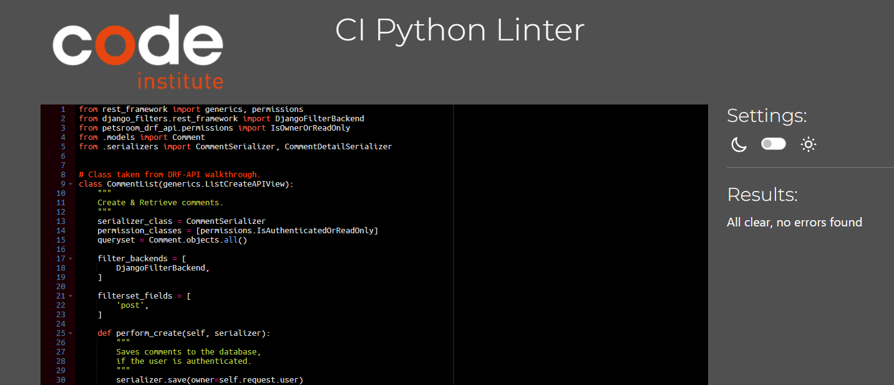

# Petsroom - API

Petsroom is a social media platform for the people who like animals, and would like to scroll through only animal posts. Users can create an events to meet with locals for a walk or any social gathering. Users can also share interesting articles they came across browsing the web. Users can interact with each others through comments. This section of the project is the backend API database built to support the ReactJS frontend, and it is powered by the Django Rest Framework.

DEPLOYED BACKEND API - [LINK](https://petsroom-drf-api-11e537707187.herokuapp.com/)

DEPLOYED FRONTEND - [LIVE SITE](https://petsroom-478d60bcd402.herokuapp.com/)

DEPLOYED FRONTEND - [GITHUB-REPOSITORY](https://github.com/DarkoZlatarek/project5-petsroom)

## [Table of content](#table-of-content)
* [User Stories](#user-stories)
* [Database](#database)
* [Testing](#testing)
    * [Validator testing](#validator-testing)
    * [Manual testing](#manual-testing)
    * [Testing with django](#testing-with-django)
    * [Unfixed bugs](#unfixed-bugs)
* [Technologies used](#technologies-used)
    * [Main Languages Used](#main-languages-used)
    * [Frameworks, Libraries & Programs Used](#frameworks)
* [Deployment](#deployment)
* [Credits](#credits)
    * [Content](#content)
    * [Media](#media)

## **User Stories**

All User Stories have been documented in their own file, the link for which can be found here: [User Stories](https://github.com/DarkoZlatarek/petsroom-drf-api/blob/main/static/userstories.md).

Links to the GitHub Issues for this project can be found [HERE](https://github.com/DarkoZlatarek/project5-petsroom/issues).
Link to KANBAN boardcan be found [HERE](https://github.com/users/DarkoZlatarek/projects/6/views/1).

## **Database**

## **Testing**

### **Validator testing**

All files passed through [CI Python Linter](https://pep8ci.herokuapp.com/) without error.

### **Manual testing**

1. Manually verified each url path opens & works without error
2. Verified that the CRUD functionality is available in each app: Articles, Events, Comments, Followers, Likes, Posts, Profiles
* Checked this by going to each link;
* Created a new item:
    * When creating an event, there was a possibility to select the date in the past
    * This was fixed by adding validate_date function in Event's models.py as per [Stack Overflow](https://stackoverflow.com/questions/50002600/django-models-datefield-prevent-past);
* Checked new item URL path;
* Edited the item without error;
* Deleted the item without error;
3. Ensured search feature for Posts, Events & Articles apps returns results without error
4. Repeated the steps for the deployed API using superuser without error

### **Testing With Django**

* tests wouldn't run - was missing DEV in env.py and with [stackoverflow](https://stackoverflow.com/questions/56318323/django-postgresql-tests-py-runtimewarning-error) I was able to realise that

* test_logged_in_user_can_create_an_event - self.assertEqual(count, 1) throwing fail 0 != 1 - fixed by adding "place" as well as the "title" into response

* test_user_cant_update_event_they_dont_own - event updating was able by any user - fixed by changing permission_classes to [IsOwnerOrReadOnly] in Event views.py under EventDetail

### **Unfixed bugs**

* None so far

## **Technologies use**

### **Main Languages Used**

* Python

### **Frameworks, Libraries & Programs Used**

* Django
* Django RestFramework
* Cloudinary
* Heroku
* Pillow
* Django Rest Auth
* PostgreSQL
* Cors Headers
* [DrawSQL](https://drawsql.app/): A platform that allows you to set up your database tables & build the connections between them for a visual layout

## **Deployment**

## **Credits**

### **Content**

### **Media**
